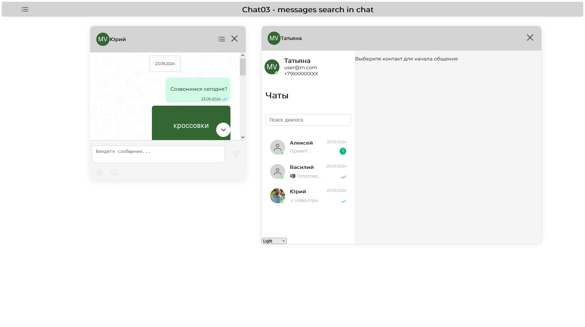

# Chotto Demo

Chat samples based on [mobilon-dev/chotto](https://github.com/mobilon-dev/chotto) library

# Demo apps list

- Chat 00 - two persons chat demo. Two float containers with feed layout, regular dialog.
- Chat01 - conversation 3 to 1 demo. Simulates conversation between manager (using base layout) and customers (using feed layout) at once.
- Chat02 - waba templates demo. Sending templates via WhatsApp Business API through determined channel.
- Chat03 - messages search in chat. Several search implementations - different positions in layouts. 
- Chat04 - adaptive to container size extended layout. 
- Chat05 - chat multidialog system. Several dialogs with one contact. 
- Chat06 - audio and video recording. Recording, listenning and sending audio and video messages.
- Chat07 - GigaChat conversation. GigaChat - Sber's AI LLM (Large Language Model). [Here](https://giga.chat/) you can learn more about it and [here](https://mobilon-dev.github.io/gigachat-api-explorer/) you can try GigaChat API in work.
- Chat08 - re-styling by user`s conditions. Several components can be restyled by user's classes.
- Chat09 - custom placeholders. Empty Feed and ChatWrapper with SplashScreen component.

# Link

[Try it now - Chat 00](https://mobilon-dev.github.io/chotto-demo/#/0)
[Try it now - Chat 01](https://mobilon-dev.github.io/chotto-demo/#/1)
[Try it now - Chat 02](https://mobilon-dev.github.io/chotto-demo/#/2)
[Try it now - Chat 03](https://mobilon-dev.github.io/chotto-demo/#/3)
[Try it now - Chat 04](https://mobilon-dev.github.io/chotto-demo/#/4)
[Try it now - Chat 05](https://mobilon-dev.github.io/chotto-demo/#/5)
[Try it now - Chat 06](https://mobilon-dev.github.io/chotto-demo/#/6)
[Try it now - Chat 07](https://mobilon-dev.github.io/chotto-demo/#/7)
[Try it now - Chat 08](https://mobilon-dev.github.io/chotto-demo/#/8)
[Try it now - Chat 09](https://mobilon-dev.github.io/chotto-demo/#/9)

# Screenshot

# Install

Type in CLI

` git clone https://github.com/determaer/chotto-demo `

` npm install `

` npm run dev `
